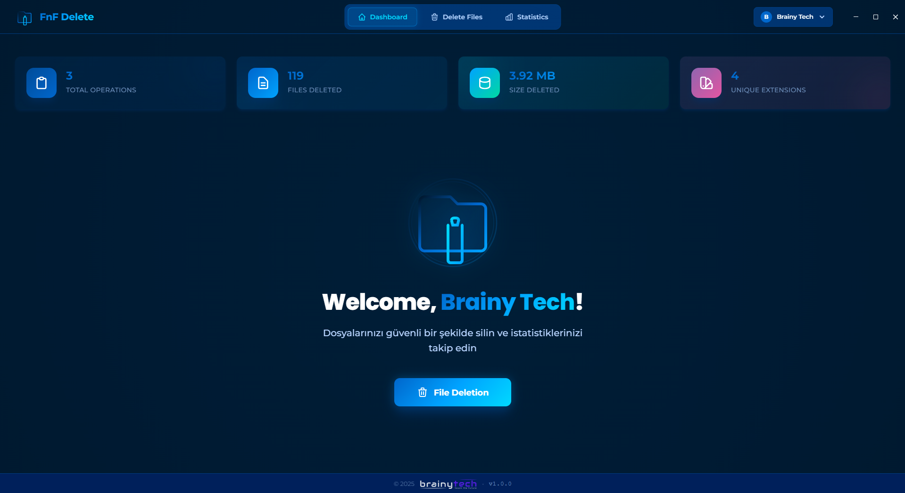
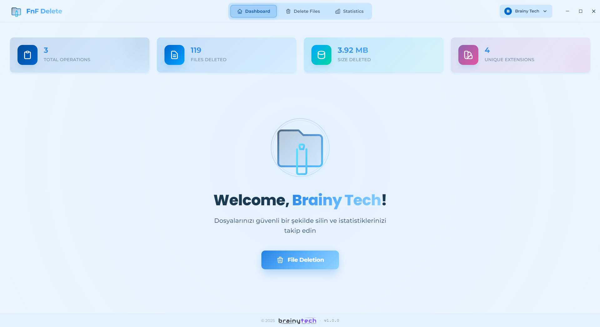
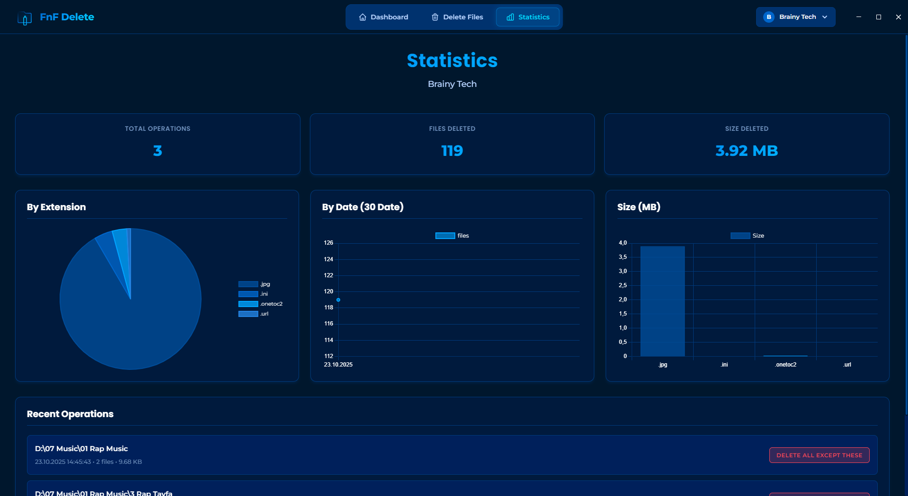
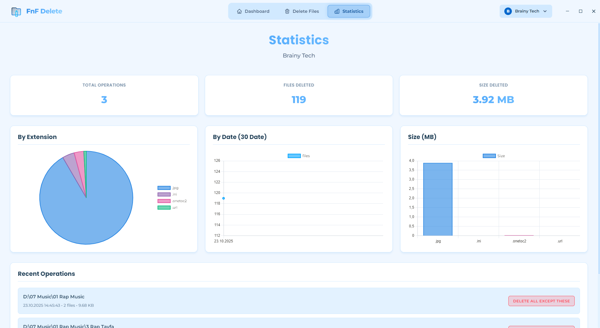
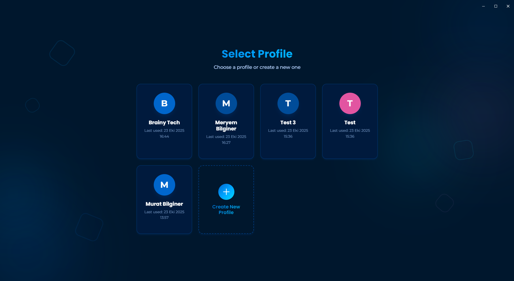
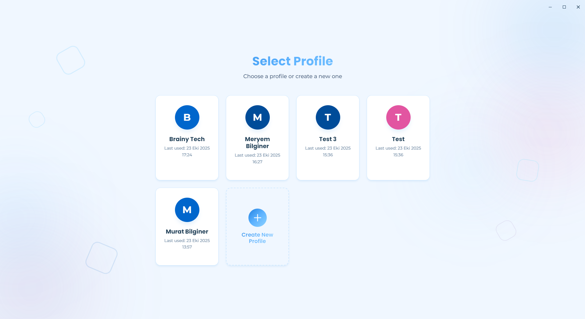

<div align="center">

<!-- Logos side by side -->
 &nbsp;&nbsp;&nbsp;|&nbsp;&nbsp;&nbsp; 

# FnF Delete

### 🗑️ Professional File & Folder Deletion Manager

[](https://opensource.org/licenses/MIT)
[](https://github.com/MuratBilginerSoft/FnF-Delete-Desktop-App)
[](https://www.electronjs.org/)
[](https://react.dev/)
[](https://github.com/MuratBilginerSoft/FnF-Delete-Desktop-App/releases)

**[English](#english)** | **[Türkçe](#türkçe)**

---

</div>

## <a name="english"></a>🇬🇧 English

### 📖 Overview

**FnF Delete** is a powerful desktop application that helps you efficiently manage and delete files and folders on your system. With advanced scanning capabilities, detailed statistics, and an intuitive user interface, file management has never been easier.

### ✨ Key Features

- 🔍 **Smart File Scanning** - Scan directories by file extensions with include/exclude modes
- 📊 **Detailed Statistics** - Track all your deletion operations with comprehensive analytics
- 👥 **Multi-Profile Support** - Create separate profiles for different users or projects
- 🎨 **Modern UI Design** - Beautiful UEFA Champions League-inspired color scheme
- 🌓 **Dark/Light Themes** - Switch between themes for comfortable usage
- 🌍 **Bilingual Interface** - Full support for Turkish and English languages
- ♻️ **Safe Deletion** - Files are moved to trash, allowing recovery if needed
- ⚡ **Fast Performance** - Built with Electron and React for optimal speed
- 💾 **SQLite Database** - Local data storage with better-sqlite3

### 🖼️ Screenshots

<div align="center">

#### 🌓 Dashboard (Dark & Light Mode)
 

#### 🗑️ File Deletion Interface (Dark & Light Mode)
 

#### 📊 Statistics View (Dark & Light Mode)
 

#### 👥 Profile Management (Dark & Light Mode)
 

</div>

### 🚀 Quick Start

#### For Users

1. Download the latest release for your platform:
   - **Windows**: `FnF Delete Setup 1.0.0.exe`
   - **macOS**: `FnF Delete-1.0.0.dmg`
   - **Linux**: `FnF Delete-1.0.0.AppImage` or `.deb`

2. Install and run the application

3. Create your first profile and start managing files!

#### For Developers

```bash
# Clone the repository
git clone https://github.com/MuratBilginerSoft/FnF-Delete-Desktop-App.git
cd FnF-Delete-Desktop-App

# Install dependencies
npm install

# Rebuild native modules
npm run rebuild

# Start development server
npm run dev
```

### 🛠️ Tech Stack

- **Framework**: [Electron](https://www.electronjs.org/) - Cross-platform desktop apps
- **UI Library**: [React 19](https://react.dev/) - Modern UI components
- **Build Tool**: [Vite 6](https://vitejs.dev/) - Lightning-fast builds
- **State Management**: [Zustand](https://zustand-demo.pmnd.rs/) - Simple state management
- **Database**: [better-sqlite3](https://github.com/WiseLibs/better-sqlite3) - Fast SQLite3
- **Styling**: Custom CSS with glassmorphism design
- **Icons**: Custom SVG icons

### 📦 Build from Source

For detailed build instructions, see [BUILD-GUIDE.md](BUILD-GUIDE.md)

**Quick build:**

```bash
# Windows
npm run build:win

# macOS (only on Mac)
npm run build:mac

# Linux
npm run build:linux
```

Build outputs will be in the `release/` directory.

### 📄 License

This project is licensed under the MIT License - see the [LICENSE](LICENSE) file for details.

### 👨‍💻 Author

**Brainy Tech Solutions**
- GitHub: [@MuratBilginerSoft](https://github.com/MuratBilginerSoft)

---

## <a name="türkçe"></a>🇹🇷 Türkçe

### 📖 Genel Bakış

**FnF Delete**, sisteminizdeki dosya ve klasörleri verimli bir şekilde yönetmenize ve silmenize yardımcı olan güçlü bir masaüstü uygulamasıdır. Gelişmiş tarama özellikleri, detaylı istatistikler ve sezgisel kullanıcı arayüzü ile dosya yönetimi hiç bu kadar kolay olmamıştı.

### ✨ Özellikler

- 🔍 **Akıllı Dosya Tarama** - Dahil etme/hariç tutma modları ile uzantılara göre klasör tarama
- 📊 **Detaylı İstatistikler** - Kapsamlı analizlerle tüm silme işlemlerinizi takip edin
- 👥 **Çoklu Profil Desteği** - Farklı kullanıcılar veya projeler için ayrı profiller oluşturun
- 🎨 **Modern Arayüz Tasarımı** - UEFA Şampiyonlar Ligi'nden ilham alan güzel renk şeması
- 🌓 **Koyu/Açık Temalar** - Rahat kullanım için temalar arasında geçiş yapın
- 🌍 **İki Dilli Arayüz** - Türkçe ve İngilizce tam desteği
- ♻️ **Güvenli Silme** - Dosyalar çöp kutusuna taşınır, gerekirse kurtarılabilir
- ⚡ **Hızlı Performans** - Optimal hız için Electron ve React ile geliştirilmiştir
- 💾 **SQLite Veritabanı** - better-sqlite3 ile yerel veri depolama

### 🖼️ Ekran Görüntüleri

<div align="center">

#### 🌓 Kontrol Paneli (Koyu & Açık Mod)
 

#### 🗑️ Dosya Silme Arayüzü (Koyu & Açık Mod)
 

#### 📊 İstatistikler Görünümü (Koyu & Açık Mod)
 

#### 👥 Profil Yönetimi (Koyu & Açık Mod)
 

</div>

### 🚀 Hızlı Başlangıç

#### Kullanıcılar İçin

1. Platformunuz için en son sürümü indirin:
   - **Windows**: `FnF Delete Setup 1.0.0.exe`
   - **macOS**: `FnF Delete-1.0.0.dmg`
   - **Linux**: `FnF Delete-1.0.0.AppImage` veya `.deb`

2. Uygulamayı kurun ve çalıştırın

3. İlk profilinizi oluşturun ve dosyaları yönetmeye başlayın!

#### Geliştiriciler İçin

```bash
# Repository'yi klonlayın
git clone https://github.com/MuratBilginerSoft/FnF-Delete-Desktop-App.git
cd FnF-Delete-Desktop-App

# Bağımlılıkları yükleyin
npm install

# Native modülleri yeniden derleyin
npm run rebuild

# Geliştirme sunucusunu başlatın
npm run dev
```

### 🛠️ Teknoloji Yığını

- **Framework**: [Electron](https://www.electronjs.org/) - Çapraz platform masaüstü uygulamaları
- **UI Kütüphanesi**: [React 19](https://react.dev/) - Modern UI bileşenleri
- **Build Aracı**: [Vite 6](https://vitejs.dev/) - Şimşek hızında build'ler
- **State Yönetimi**: [Zustand](https://zustand-demo.pmnd.rs/) - Basit state yönetimi
- **Veritabanı**: [better-sqlite3](https://github.com/WiseLibs/better-sqlite3) - Hızlı SQLite3
- **Stil**: Glassmorphism tasarımlı özel CSS
- **İkonlar**: Özel SVG ikonlar

### 📦 Kaynak Koddan Build

**Hızlı build:**

```bash
# Windows
npm run build:win

# macOS (sadece Mac'te)
npm run build:mac

# Linux
npm run build:linux
```

Build çıktıları `release/` dizininde olacaktır.

### 🤝 Katkıda Bulunma

Katkılar memnuniyetle karşılanır! Lütfen Pull Request göndermekten çekinmeyin.

1. Repository'yi fork edin
2. Feature branch'inizi oluşturun (`git checkout -b feature/HarikaÖzellik`)
3. Değişikliklerinizi commit edin (`git commit -m 'Harika bir özellik ekle'`)
4. Branch'inizi push edin (`git push origin feature/HarikaÖzellik`)
5. Pull Request açın

### 📄 Lisans

Bu proje MIT Lisansı altında lisanslanmıştır - detaylar için [LICENSE](LICENSE) dosyasına bakın.

### 👨‍💻 Geliştirici

**Brainy Tech Solutions**
- GitHub: [@MuratBilginerSoft](https://github.com/MuratBilginerSoft)

---

<div align="center">

Made with ❤️ by [Brainy Tech Solutions](https://brainytech.net)

</div>
