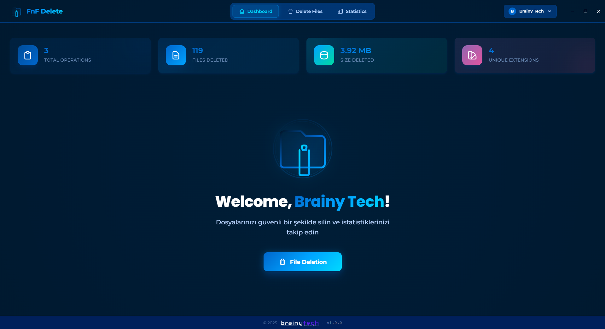
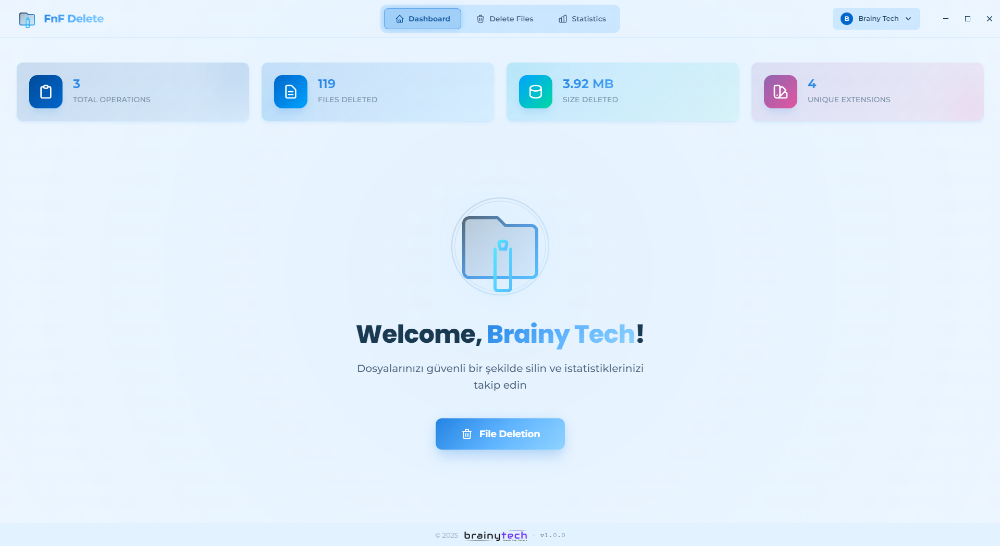
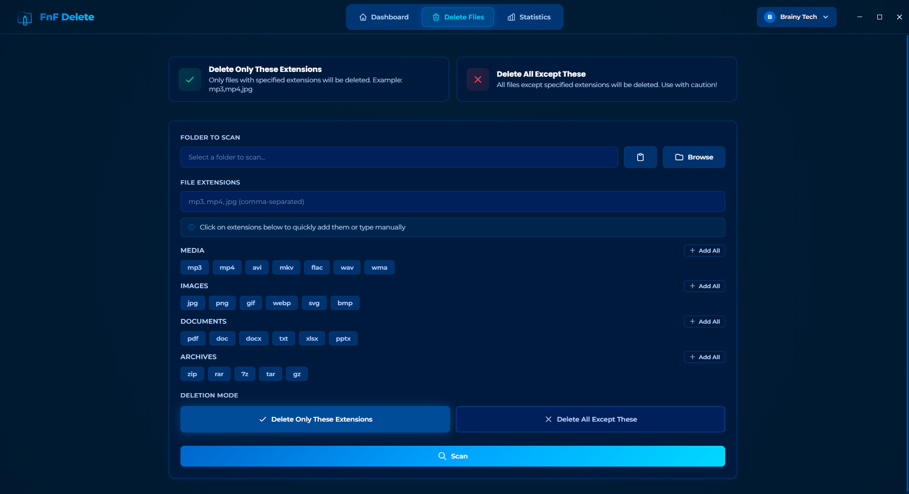
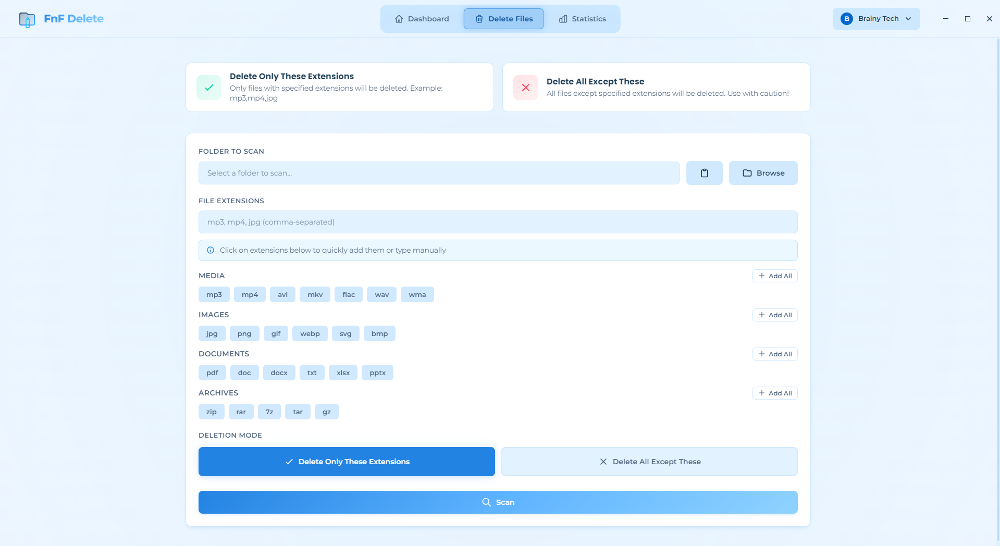
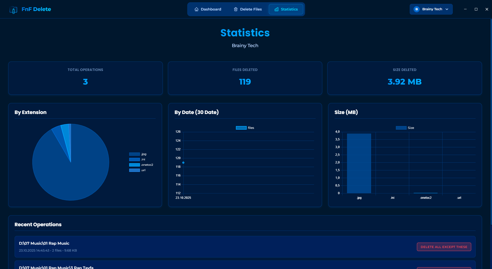
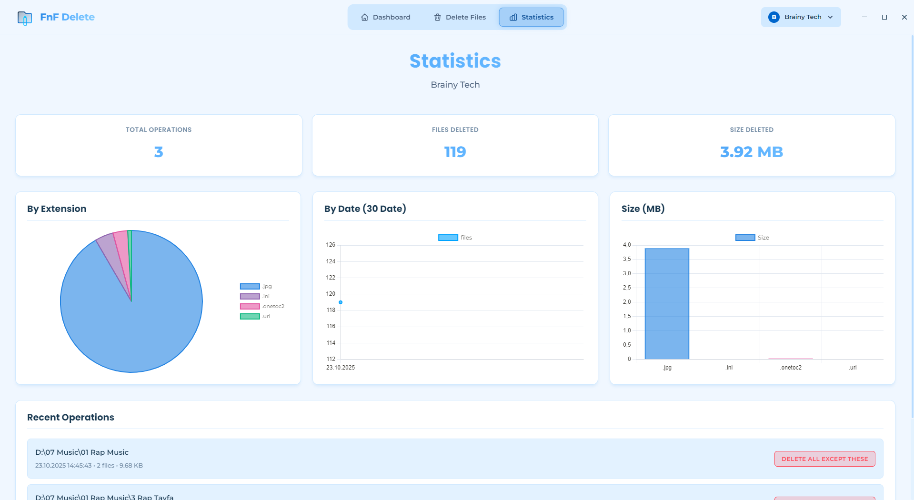
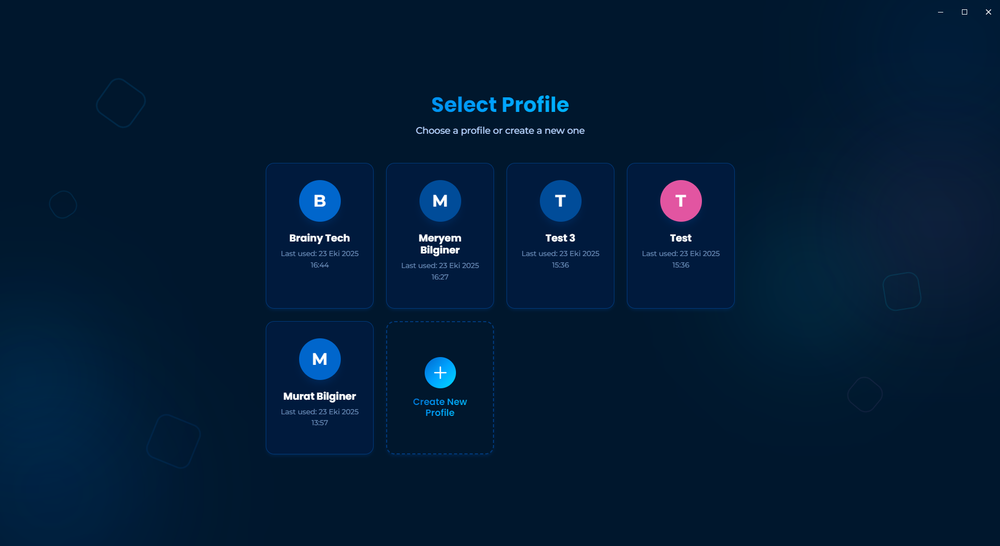
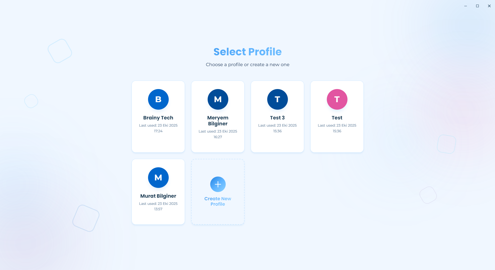

<div align="center">

<!-- Logos side by side -->
 &nbsp;&nbsp;&nbsp;|&nbsp;&nbsp;&nbsp; 

# FnF Delete

### 🗑️ Professional File Deletion Manager

[](https://opensource.org/licenses/MIT)
[](https://github.com/MuratBilginerSoft/FnF-Delete-Desktop-App)
[](https://www.electronjs.org/)
[](https://react.dev/)
[](https://github.com/MuratBilginerSoft/FnF-Delete-Desktop-App/releases)
[](https://www.virustotal.com/gui/file/0a8e743991c343a56e57aaa751b09016ae22a4ceebabacecf8efb597e1bbc641/behavior)

**[English](#english)** | **[Türkçe](#türkçe)**

---

</div>

## <a name="english"></a>🇬🇧 English

### 📖 Overview

**FnF Delete** is a powerful desktop application that helps you efficiently manage and delete files on your system. With advanced scanning capabilities, detailed statistics, and an intuitive user interface, file management has never been easier.

### ✨ Key Features

- 🔍 **Smart File Scanning** - Scan directories by file extensions with include/exclude modes
- 📁 **Recursive Scanning Control** - Choose to scan only current folder or include all subfolders
- 💾 **Saved Paths System** - Save and quickly access frequently used directory paths
- 🗑️ **All Files Mode** - Delete all files in a directory regardless of extension
- ☑️ **File Selection** - Select specific files with checkboxes before deletion
- 📊 **Detailed Statistics** - Track all your deletion operations with comprehensive analytics
- 👥 **Multi-Profile Support** - Create separate profiles for different users or projects
- 🔄 **Auto-Update System** - Automatic update detection and one-click installation
- 🎨 **Modern UI Design** - Beautiful UEFA Champions League-inspired color scheme
- 🌓 **Dark/Light Themes** - Switch between themes for comfortable usage
- 🌍 **Bilingual Interface** - Full support for Turkish and English languages
- ♻️ **Safe Deletion** - Files are moved to trash, allowing recovery if needed
- 🗑️ **Recycle Bin Management** - View, filter, search and permanently delete files from trash
- 👁️ **File Preview** - Open files with default application before deletion
- ⚡ **Fast Performance** - Built with Electron and React for optimal speed
- 💿 **SQLite Database** - Local data storage with better-sqlite3
- 💾 **Backup & Restore** - Export all data to JSON and import on another PC

### 🔒 Security & Safety

**FnF Delete is completely safe and secure:**

[](https://www.virustotal.com/gui/file/0a8e743991c343a56e57aaa751b09016ae22a4ceebabacecf8efb597e1bbc641/behavior)

- ✅ **Open Source** - All code is publicly available for review
- ✅ **VirusTotal Verified** - Scanned and verified clean by 70+ antivirus engines
- ✅ **No Telemetry** - We don't collect or send any data
- ✅ **Local Storage** - All data stays on your computer
- ✅ **Safe Deletion** - Files moved to trash, not permanently deleted
- ✅ **MIT Licensed** - Free and open source software

#### ⚠️ Windows SmartScreen Warning

When downloading and running the application for the first time, you might see a Windows SmartScreen warning:

**"Windows protected your PC"** or **"Unknown publisher"**

**This is normal for new applications without expensive code signing certificates ($300+/year).**

The application is **completely safe** and verified:
- ✅ Scanned by VirusTotal: [View Full Report](https://www.virustotal.com/gui/file/0a8e743991c343a56e57aaa751b09016ae22a4ceebabacecf8efb597e1bbc641/behavior)
- ✅ Submitted to Microsoft for verification
- ✅ Open source code available for review

**How to install:**
1. Click **"More info"**
2. Click **"Run anyway"**
3. The application will install normally

We're working on obtaining a code signing certificate to eliminate this warning in future releases.

### 🖼️ Screenshots

<div align="center">

#### 🌓 Dashboard (Dark & Light Mode)
 

#### 🗑️ File Deletion Interface (Dark & Light Mode)
 

#### 📊 Statistics View (Dark & Light Mode)
 

#### 👥 Profile Management (Dark & Light Mode)
 

</div>

### 🚀 Quick Start

#### For Users

1. Download the latest release for your platform:
   - **Windows**: `FnF Delete Setup 1.4.2.exe`
   - **Linux**: `FnF-Delete-1.4.2.AppImage` (Universal) or `fnf-delete_1.4.2_amd64.deb` (Debian/Ubuntu)
   - **macOS**: Coming soon!

2. Install and run the application

3. Create your first profile and start managing files!

#### For Developers

```bash
# Clone the repository
git clone https://github.com/MuratBilginerSoft/FnF-Delete-Desktop-App.git
cd FnF-Delete-Desktop-App

# Install dependencies
npm install

# Rebuild native modules
npm run rebuild

# Start development server
npm run dev
```

### 🛠️ Tech Stack

- **Framework**: [Electron](https://www.electronjs.org/) - Cross-platform desktop apps
- **UI Library**: [React 19](https://react.dev/) - Modern UI components
- **Build Tool**: [Vite 6](https://vitejs.dev/) - Lightning-fast builds
- **State Management**: [Zustand](https://zustand-demo.pmnd.rs/) - Simple state management
- **Database**: [better-sqlite3](https://github.com/WiseLibs/better-sqlite3) - Fast SQLite3
- **Styling**: Custom CSS with glassmorphism design
- **Icons**: Custom SVG icons

### 📦 Build from Source

For detailed build instructions, see [BUILD-GUIDE.md](BUILD-GUIDE.md)

**Quick build:**

```bash
# Windows
npm run build:win

# macOS (only on Mac)
npm run build:mac

# Linux
npm run build:linux
```

Build outputs will be in the `release/` directory.

### 📄 License

This project is licensed under the MIT License - see the [LICENSE](LICENSE) file for details.

### 👨‍💻 Author

**Brainy Tech Solutions**
- GitHub: [@MuratBilginerSoft](https://github.com/MuratBilginerSoft)

---

## <a name="türkçe"></a>🇹🇷 Türkçe

### 📖 Genel Bakış

**FnF Delete**, sisteminizdeki dosyaları verimli bir şekilde yönetmenize ve silmenize yardımcı olan güçlü bir masaüstü uygulamasıdır. Gelişmiş tarama özellikleri, detaylı istatistikler ve sezgisel kullanıcı arayüzü ile dosya yönetimi hiç bu kadar kolay olmamıştı.

### ✨ Özellikler

- 🔍 **Akıllı Dosya Tarama** - Dahil etme/hariç tutma modları ile uzantılara göre klasör tarama
- 📁 **Özyinelemeli Tarama Kontrolü** - Sadece mevcut klasörü veya tüm alt klasörleri taramayı seçin
- 💾 **Kaydedilmiş Yollar Sistemi** - Sık kullanılan dizin yollarını kaydedin ve hızlıca erişin
- 🗑️ **Tüm Dosyalar Modu** - Uzantıdan bağımsız olarak bir dizindeki tüm dosyaları silin
- ☑️ **Dosya Seçimi** - Silmeden önce onay kutuları ile belirli dosyaları seçin
- 📊 **Detaylı İstatistikler** - Kapsamlı analizlerle tüm silme işlemlerinizi takip edin
- 👥 **Çoklu Profil Desteği** - Farklı kullanıcılar veya projeler için ayrı profiller oluşturun
- 🔄 **Otomatik Güncelleme Sistemi** - Otomatik güncelleme algılama ve tek tıkla kurulum
- 🎨 **Modern Arayüz Tasarımı** - UEFA Şampiyonlar Ligi'nden ilham alan güzel renk şeması
- 🌓 **Koyu/Açık Temalar** - Rahat kullanım için temalar arasında geçiş yapın
- 🌍 **İki Dilli Arayüz** - Türkçe ve İngilizce tam desteği
- ♻️ **Güvenli Silme** - Dosyalar çöp kutusuna taşınır, gerekirse kurtarılabilir
- 🗑️ **Geri Dönüşüm Kutusu Yönetimi** - Çöp kutusundaki dosyaları görüntüle, filtrele, ara ve kalıcı sil
- 👁️ **Dosya Önizleme** - Silmeden önce dosyaları varsayılan uygulamayla aç
- ⚡ **Hızlı Performans** - Optimal hız için Electron ve React ile geliştirilmiştir
- 💿 **SQLite Veritabanı** - better-sqlite3 ile yerel veri depolama
- 💾 **Yedekleme & Geri Yükleme** - Tüm verileri JSON'a aktar ve başka PC'de içe aktar

### 🔒 Güvenlik ve Emniyet

**FnF Delete tamamen güvenli ve emniyetlidir:**

[](https://www.virustotal.com/gui/file/0a8e743991c343a56e57aaa751b09016ae22a4ceebabacecf8efb597e1bbc641/behavior)

- ✅ **Açık Kaynak** - Tüm kod inceleme için herkese açık
- ✅ **VirusTotal Doğrulaması** - 70+ antivirüs motoru tarafından taranmış ve temiz bulunmuş
- ✅ **Veri Toplama Yok** - Hiçbir veri toplamıyoruz veya göndermiyoruz
- ✅ **Yerel Depolama** - Tüm verileriniz bilgisayarınızda kalır
- ✅ **Güvenli Silme** - Dosyalar kalıcı olarak silinmez, çöp kutusuna taşınır
- ✅ **MIT Lisanslı** - Özgür ve açık kaynak yazılım

#### ⚠️ Windows SmartScreen Uyarısı

Uygulamayı ilk kez indirip çalıştırdığınızda bir Windows SmartScreen uyarısı görebilirsiniz:

**"Windows bilgisayarınızı korudu"** veya **"Bilinmeyen yayımcı"**

**Bu, pahalı kod imzalama sertifikası olmayan yeni uygulamalar için normaldir ($300+/yıl).**

Uygulama **tamamen güvenlidir** ve doğrulanmıştır:
- ✅ VirusTotal tarafından taranmış: [Tam Raporu Görüntüle](https://www.virustotal.com/gui/file/0a8e743991c343a56e57aaa751b09016ae22a4ceebabacecf8efb597e1bbc641/behavior)
- ✅ Microsoft'a doğrulama için gönderilmiş
- ✅ Açık kaynak kodu inceleme için hazır

**Nasıl kurulur:**
1. **"Daha fazla bilgi"** tıklayın
2. **"Yine de çalıştır"** tıklayın
3. Uygulama normal şekilde kurulacaktır

Gelecek sürümlerde bu uyarıyı ortadan kaldırmak için kod imzalama sertifikası almak üzerinde çalışıyoruz.

### 🖼️ Ekran Görüntüleri

<div align="center">

#### 🌓 Kontrol Paneli (Koyu & Açık Mod)
 

#### 🗑️ Dosya Silme Arayüzü (Koyu & Açık Mod)
 

#### 📊 İstatistikler Görünümü (Koyu & Açık Mod)
 

#### 👥 Profil Yönetimi (Koyu & Açık Mod)
 

</div>

### 🚀 Hızlı Başlangıç

#### Kullanıcılar İçin

1. Platformunuz için en son sürümü indirin:
   - **Windows**: `FnF Delete Setup 1.4.2.exe`
   - **Linux**: `FnF-Delete-1.4.2.AppImage` (Evrensel) veya `fnf-delete_1.4.2_amd64.deb` (Debian/Ubuntu)
   - **macOS**: Yakında gelecek!

2. Uygulamayı kurun ve çalıştırın

3. İlk profilinizi oluşturun ve dosyaları yönetmeye başlayın!

#### Geliştiriciler İçin

```bash
# Repository'yi klonlayın
git clone https://github.com/MuratBilginerSoft/FnF-Delete-Desktop-App.git
cd FnF-Delete-Desktop-App

# Bağımlılıkları yükleyin
npm install

# Native modülleri yeniden derleyin
npm run rebuild

# Geliştirme sunucusunu başlatın
npm run dev
```

### 🛠️ Teknoloji Yığını

- **Framework**: [Electron](https://www.electronjs.org/) - Çapraz platform masaüstü uygulamaları
- **UI Kütüphanesi**: [React 19](https://react.dev/) - Modern UI bileşenleri
- **Build Aracı**: [Vite 6](https://vitejs.dev/) - Şimşek hızında build'ler
- **State Yönetimi**: [Zustand](https://zustand-demo.pmnd.rs/) - Basit state yönetimi
- **Veritabanı**: [better-sqlite3](https://github.com/WiseLibs/better-sqlite3) - Hızlı SQLite3
- **Stil**: Glassmorphism tasarımlı özel CSS
- **İkonlar**: Özel SVG ikonlar

### 📦 Kaynak Koddan Build

**Hızlı build:**

```bash
# Windows
npm run build:win

# macOS (sadece Mac'te)
npm run build:mac

# Linux
npm run build:linux
```

Build çıktıları `release/` dizininde olacaktır.

### 🤝 Katkıda Bulunma

Katkılar memnuniyetle karşılanır! Lütfen Pull Request göndermekten çekinmeyin.

1. Repository'yi fork edin
2. Feature branch'inizi oluşturun (`git checkout -b feature/HarikaÖzellik`)
3. Değişikliklerinizi commit edin (`git commit -m 'Harika bir özellik ekle'`)
4. Branch'inizi push edin (`git push origin feature/HarikaÖzellik`)
5. Pull Request açın

### 📄 Lisans

Bu proje MIT Lisansı altında lisanslanmıştır - detaylar için [LICENSE](LICENSE) dosyasına bakın.

### 👨‍💻 Geliştirici

**Brainy Tech Solutions**
- GitHub: [@MuratBilginerSoft](https://github.com/MuratBilginerSoft)

---

<div align="center">

Made with ❤️ by [Brainy Tech Solutions](https://brainytech.net)

</div>
